# Logic Flow - Web Toolbox PKC

## Overview

Dokumen ini menjelaskan alur bisnis dan perjalanan pengguna (user journey) dalam aplikasi Web Toolbox PKC. Aplikasi ini dirancang untuk memfasilitasi manajemen task, meeting, dan dokumentasi notulensi untuk perusahaan seperti PT Pupuk Kujang.

## User Roles & Permissions

### 1. Admin

- Mengelola semua user dan departemen
- Akses penuh ke semua task dan meeting
- Konfigurasi sistem dan notifikasi
- Export data dan laporan

### 2. Manager

- Membuat dan mengelola task untuk tim
- Mengatur meeting dan notulensi
- Melihat progress tim dan laporan
- Approve task completion

### 3. Employee

- Melihat dan mengerjakan task yang ditugaskan
- Berpartisipasi dalam meeting
- Update status task
- Melihat notifikasi dan reminder

## Core Business Flows

### 1. User Authentication Flow

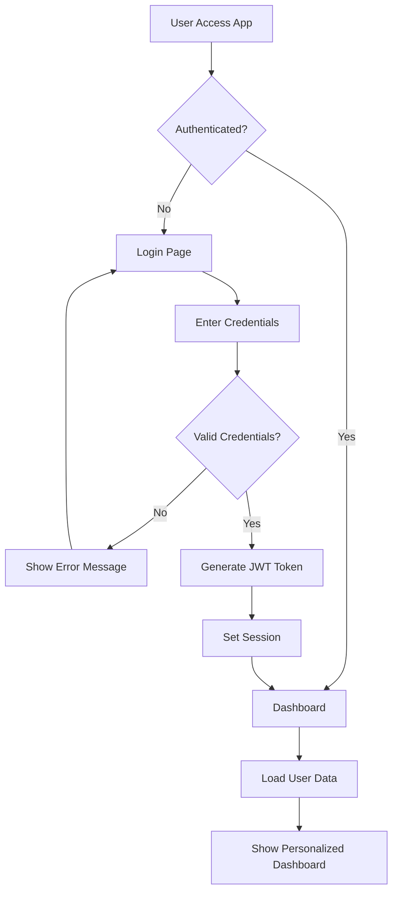

**Steps:**

1. User mengakses aplikasi
2. Sistem cek authentication status
3. Jika belum login, redirect ke login page
4. User input email dan password
5. Sistem validasi credentials
6. Jika valid, generate JWT token dan set session
7. Redirect ke dashboard dengan data user

### 2. Task Management Flow

#### 2.1 Task Creation Flow

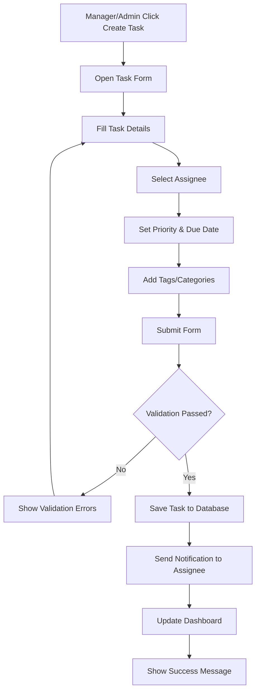

**Business Rules:**

- Hanya Manager dan Admin yang bisa membuat task
- Task harus memiliki title, assignee, dan due date
- Priority default adalah 'medium'
- Notification otomatis dikirim ke assignee
- Task dengan priority 'urgent' mendapat notifikasi khusus

#### 2.2 Task Execution Flow

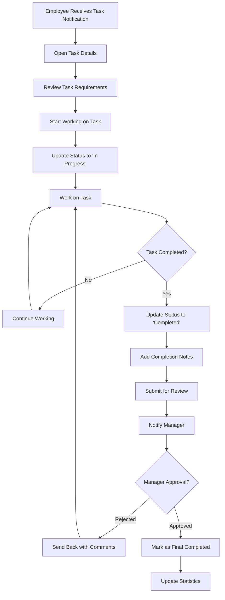

**Business Rules:**

- Employee hanya bisa update task yang ditugaskan kepada mereka
- Status change otomatis trigger notifikasi ke manager
- Task yang overdue mendapat highlight khusus
- Completion memerlukan approval dari manager (opsional)

### 3. Meeting Management Flow

#### 3.1 Meeting Scheduling Flow

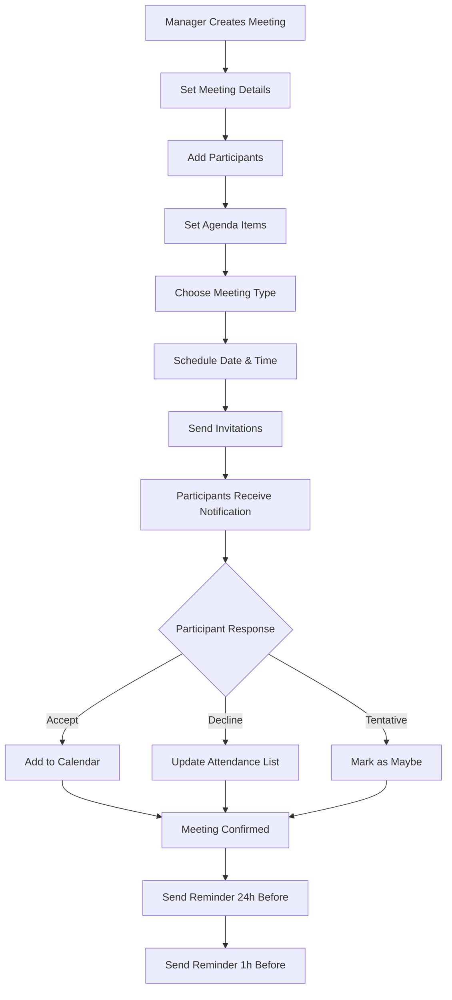

**Business Rules:**

- Meeting harus memiliki minimal 2 participants
- Reminder otomatis dikirim 24 jam dan 1 jam sebelum meeting
- Participants bisa decline dengan alasan
- Meeting bisa virtual, onsite, atau hybrid

#### 3.2 QR Code Generation Flow

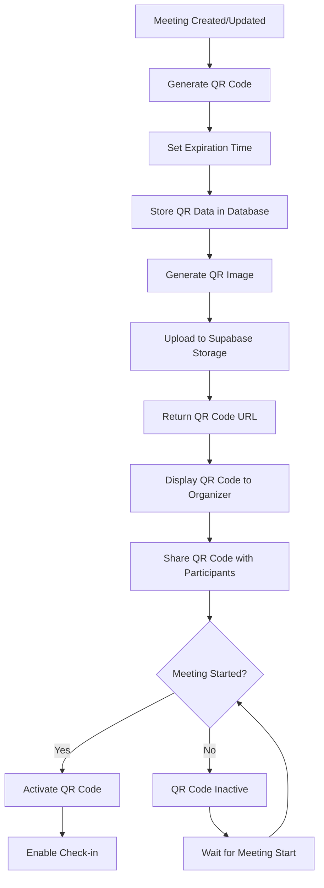

#### 3.3 Meeting Check-in Flow

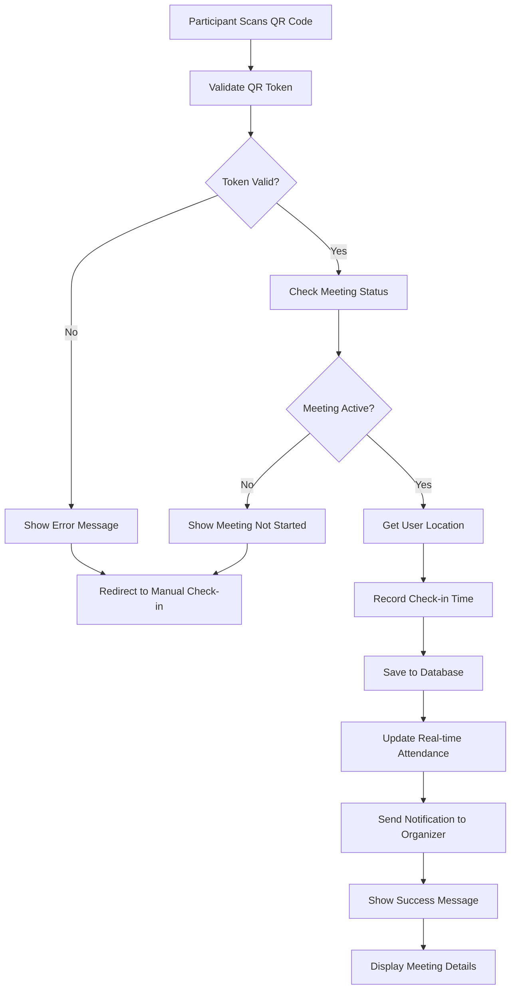

#### 3.4 Meeting Execution Flow

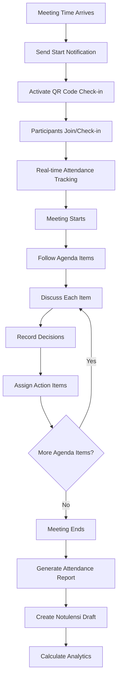

### 4. Notulensi Flow

#### 4.1 Notulensi Creation Flow

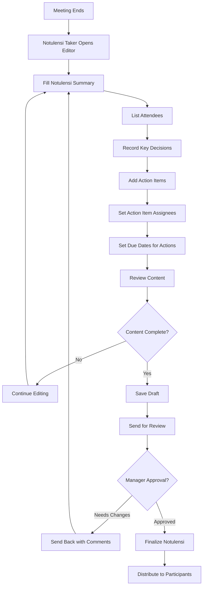

#### 4.2 Notulensi Distribution Flow

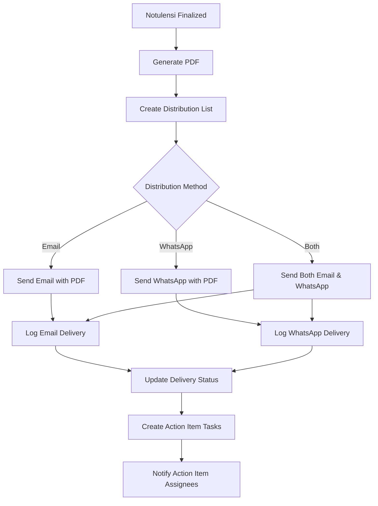

**Business Rules:**

- Notulensi harus di-approve sebelum distribusi
- PDF otomatis di-generate saat finalisasi
- Action items otomatis menjadi task baru
- Delivery status di-track untuk audit

### 5. Notification & Reminder System

#### 5.1 Notification Trigger Flow

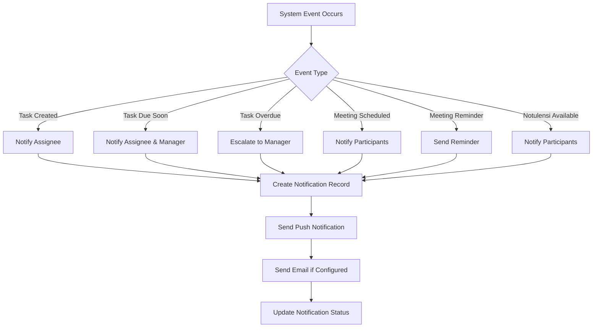

#### 5.2 Reminder Logic Flow

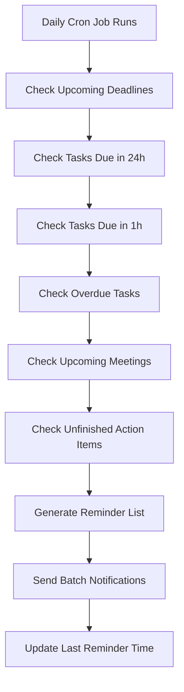

**Reminder Rules:**

- Task reminder: 24 jam, 1 jam sebelum due date
- Meeting reminder: 24 jam, 1 jam sebelum meeting
- Overdue task: Daily reminder sampai completed
- Action item: Weekly reminder jika belum completed

### 6. Dashboard & Analytics Flow

#### 6.1 Dashboard Data Loading

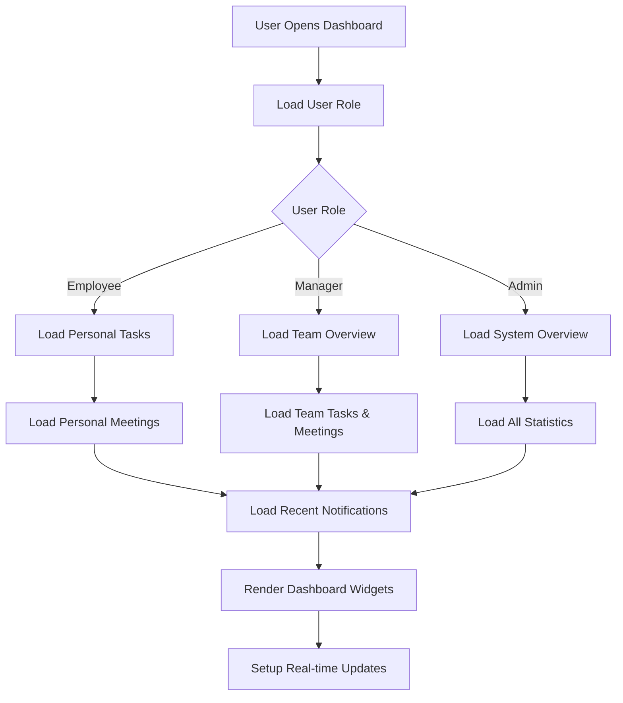

#### 6.2 Analytics Calculation Flow

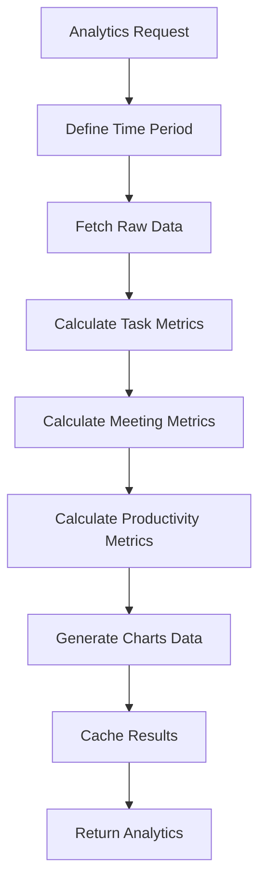

**Analytics Metrics:**

- Task completion rate
- Average task duration
- Overdue task percentage
- Meeting attendance rate
- Action item completion rate
- Team productivity trends

### 7. Integration Flows

#### 7.1 WhatsApp Integration Flow

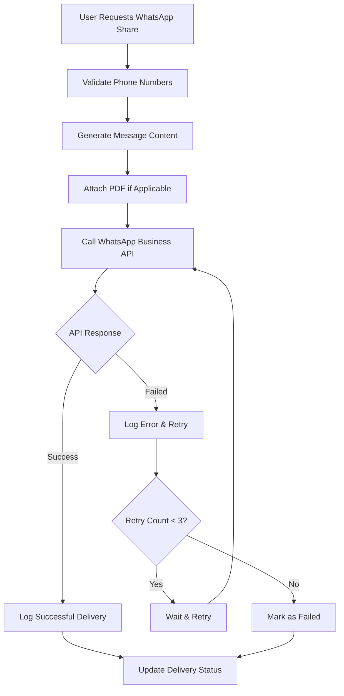

#### 7.2 Email Integration Flow

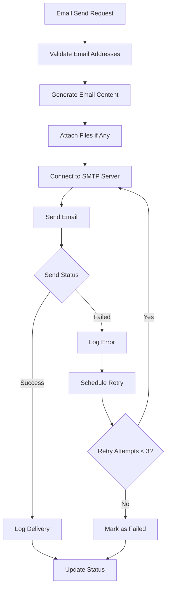

### 8. Analytics & Reporting Flow

#### 8.1 Real-time Analytics Flow

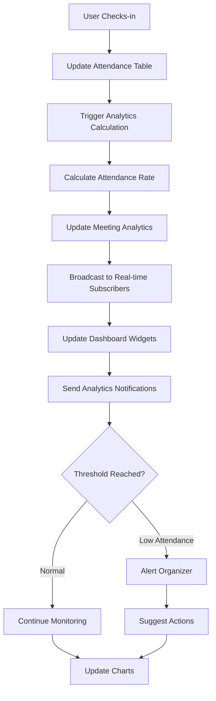

#### 8.2 Analytics Dashboard Flow

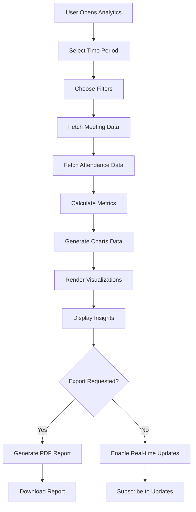

#### 8.3 Attendance Analytics Calculation

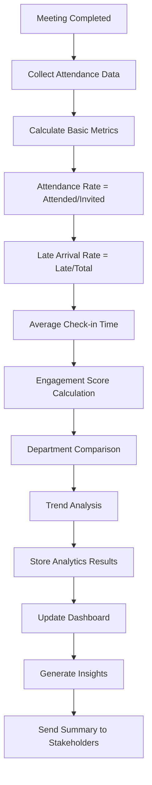

### 9. Error Handling & Recovery

#### 8.1 System Error Flow

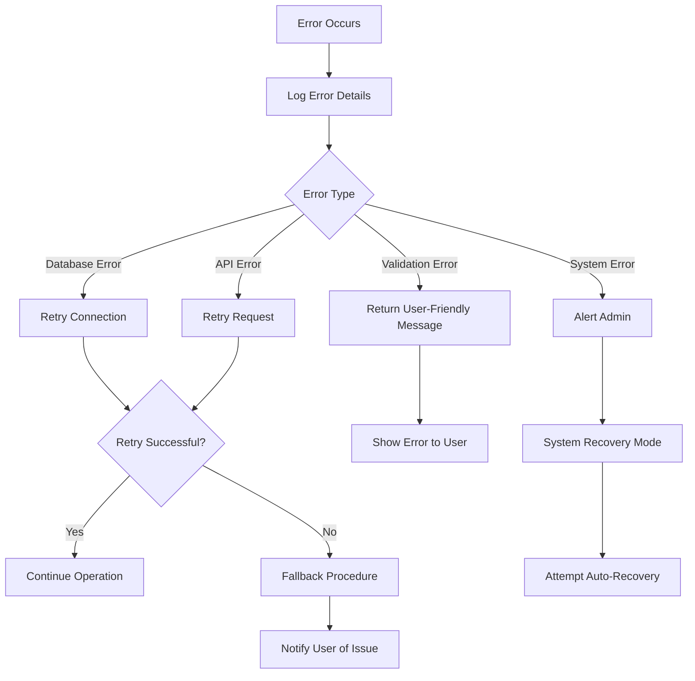

### 10. Data Backup & Recovery

#### 9.1 Backup Flow

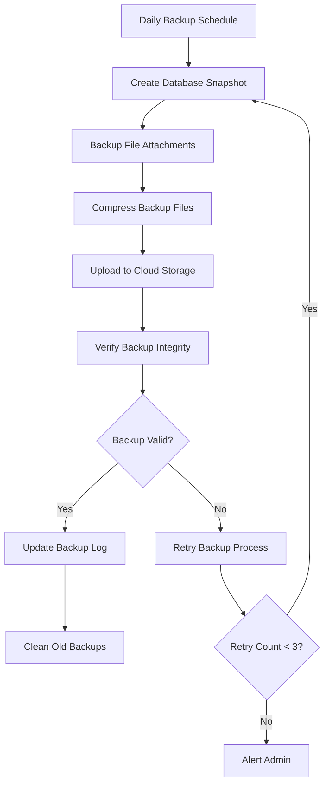

### 11. QR Code Security Flow

#### 11.1 QR Code Validation Flow

```mermaid
flowchart TD
    A[QR Code Scanned] --> B[Extract Token & Meeting ID]
    B --> C[Validate Token Format]
    C --> D{Format Valid?}
    D -->|No| E[Return Invalid QR Error]
    D -->|Yes| F[Check Token in Database]
    E --> G[Log Security Event]
    F --> H{Token Exists?}
    H -->|No| I[Return Token Not Found]
    H -->|Yes| J[Check Expiration]
    I --> G
    J --> K{Token Expired?}
    K -->|Yes| L[Return Expired Token]
    K -->|No| M[Validate Meeting Status]
    L --> G
    M --> N{Meeting Active?}
    N -->|No| O[Return Meeting Inactive]
    N -->|Yes| P[Allow Check-in]
    O --> G
    P --> Q[Log Successful Validation]
```

#### 11.2 Anti-fraud Measures

```mermaid
flowchart TD
    A[Check-in Attempt] --> B[Validate Device Info]
    B --> C[Check Location if Required]
    C --> D[Verify User Identity]
    D --> E{Duplicate Check-in?}
    E -->|Yes| F[Block Duplicate]
    E -->|No| G[Check Rate Limiting]
    F --> H[Log Fraud Attempt]
    G --> I{Too Many Attempts?}
    I -->|Yes| J[Temporary Block]
    I -->|No| K[Allow Check-in]
    J --> H
    K --> L[Record Successful Check-in]
    H --> M[Alert Security Team]
    L --> N[Update Analytics]
```

## Performance Optimization Strategies

### 1. Database Optimization

- Index pada kolom yang sering di-query (user_id, due_date, status)
- Pagination untuk large datasets
- Database connection pooling
- Query optimization dan caching

### 2. Frontend Optimization

- Lazy loading untuk komponen besar
- Virtual scrolling untuk attendance lists
- Image optimization dengan next/image
- Code splitting per route
- Chart.js lazy loading untuk analytics
- QR scanner component lazy loading

### 3. Caching Strategy

- Supabase built-in caching
- Browser caching untuk static assets
- API response caching untuk analytics data
- Database query result caching
- QR code image caching
- Analytics dashboard data caching

### 4. Real-time Updates

- Supabase Realtime untuk live attendance updates
- WebSocket untuk live notifications
- Server-Sent Events untuk dashboard updates
- Optimistic UI updates untuk better UX
- Real-time analytics dashboard

### 5. QR Code Optimization

- QR code caching untuk reduce generation time
- Batch QR code generation untuk multiple meetings
- Compressed QR data untuk faster scanning
- Progressive image loading untuk QR displays

## Security Considerations

### 1. Authentication & Authorization

- JWT token dengan expiration
- Role-based access control (RBAC)
- Session management
- Password hashing dengan bcrypt

### 2. Data Protection

- Input validation dan sanitization
- SQL injection prevention
- XSS protection
- CSRF tokens

### 3. File Security

- File type validation
- Virus scanning untuk uploads
- Secure file storage
- Access control untuk file downloads

### 4. Communication Security

- HTTPS enforcement
- API rate limiting
- Secure headers
- Environment variable protection

Dokumen ini memberikan panduan lengkap tentang alur bisnis dan logic flow dalam aplikasi Web Toolbox PKC, memastikan semua stakeholder memahami bagaimana sistem bekerja dari end-to-end.
